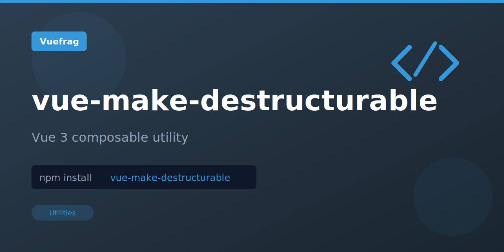

<p align="center">
  
</p>

<h1 align="center">vue-make-destructurable</h1>

<p align="center"></p>

<p align="center">
  <a href="https://www.npmjs.com/package/vue-make-destructurable"></a>
  <a href="https://www.npmjs.com/package/vue-make-destructurable"></a>
</p>

## Installation

```bash
npm install vue-make-destructurable
```

## Usage

```ts
import { makeDestructurable } from '@vueuse/core'

const foo = { name: 'foo' }
const bar = 1024

const obj = makeDestructurable(
  { foo, bar } as const,
  [foo, bar] as const,
)
```

## License

MIT

Extracted from [VueUse](https://vueuse.org/) for standalone use.
